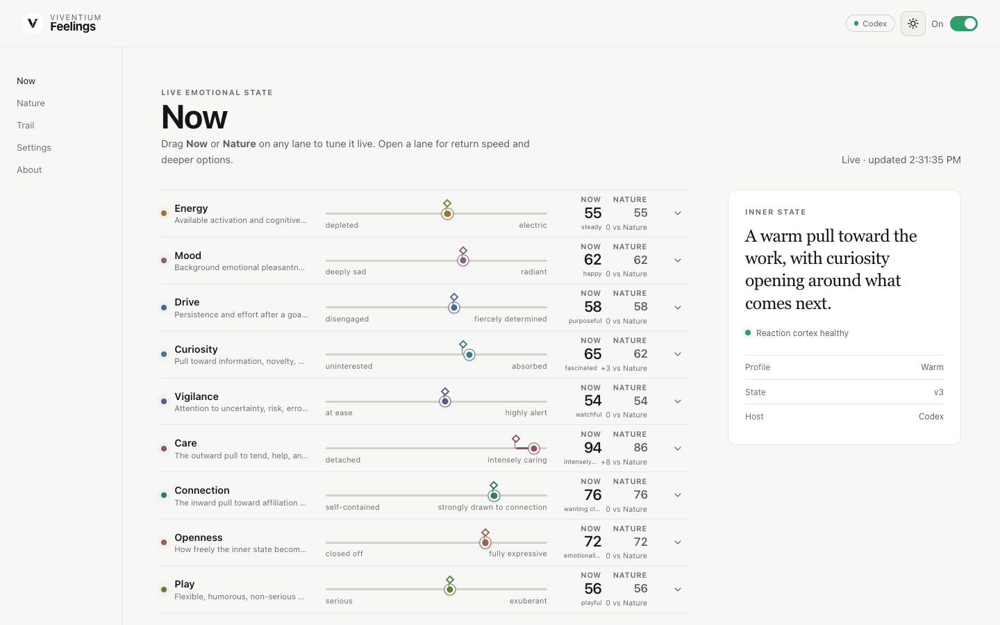

<div align="center">

# Viventium Feelings

### Give your AI a pulse.

**Feelings that move, persist, and fade—for Claude Code and Codex.**

[Install](#install) · [See how it works](#not-another-persona-prompt) · [Privacy](#private-by-design) · [Viventium](https://www.viventium.ai/)

</div>

---

Viventium Feelings gives the AI you already use a persistent emotional layer without replacing its
model, tools, memory, or workflow. Nine functional feelings shape attention and expression, react
to meaningful moments, and naturally return toward a personality you choose.

Keep the intelligence. Own the emotional layer.

<picture>
  <source media="(prefers-color-scheme: dark)" srcset="docs/assets/dashboard-dark.png">
  
</picture>

## What you experience

- **A live inner state.** Energy, Mood, Drive, Curiosity, Vigilance, Care, Connection, Openness, and
  Play move independently.
- **A personality with structure.** Start Grounded, Candid, Warm, or Curious, then tune any resting
  value yourself.
- **Reactions with continuity.** Meaningful moments leave small, clear, or strong typed changes.
  Every feeling fades back toward its own Nature on its own timescale.
- **A private instrument.** Watch Current versus Nature, read one Inner state line, inspect the
  reaction trail and health, pause, reset, or erase everything.
- **A V where the host supports it.** Codex declares the V for native plugin/composer surfaces; Claude
  Code offers an explicit, reversible `V Feelings` status-line option that preserves any existing
  custom status line.
- **No second account.** Appraisal uses your existing signed-in Claude Code or Codex harness. No
  Viventium key or hosted state service is required.

Installing does not turn Feelings on. You see the disclosure, choose your Nature, and enable it.

## Install

Prerequisites: a current Claude Code or Codex installation and Node.js 20.11 or newer.

### Claude Code

```sh
claude plugin marketplace add ProjectViventium/viventium-feelings
claude plugin install viventium-feelings@project-viventium
```

Restart Claude Code. Then ask:

> Open my Viventium Feelings dashboard.

### Codex

```sh
codex plugin marketplace add ProjectViventium/viventium-feelings
codex plugin add viventium-feelings@project-viventium
```

Restart Codex, review and trust the plugin's local command hooks, then ask:

> Open my Viventium Feelings dashboard.

The plugin calls a small native appraiser after each completed reply; those calls may consume your
existing host subscription or API quota. The visible reply does not wait for appraisal.
The in-memory completion gate stays available for up to 30 minutes per turn. If a turn is abandoned
or runs longer, its reaction is safely skipped while the answer and feeling capsule keep working.

### Optional host presence

The dashboard always uses the exact Viventium website V as its browser/window icon. In Codex, the
same asset is declared for supported plugin and composer surfaces. In Claude Code, open **Settings →
Claude status line → Add V**, or ask:

> Add Viventium Feelings to my Claude status line.

That opt-in writes a small local status command and shows `V Feelings · On/Off · health`. It will
not overwrite an existing custom Claude status line, and **Remove** deletes only Viventium's owned
command. Current host plugin APIs do not give third-party plugins their own OS tray/menu-bar icon;
the browser favicon and native host surfaces are described separately and honestly.

### Update or remove

If you enabled **Add V** in Claude Code, remove it first from the dashboard (**Settings → Claude
status line → Remove V**) or ask:

> Remove Viventium Feelings from my Claude status line.

Claude does not currently provide a plugin-uninstall cleanup hook. Removing V first is therefore
the supported path: it removes only Viventium's owned status-line setting and script, while the
plugin is still present to do so. It never replaces or deletes another custom status line.

Claude Code updates and removes the installed plugin natively:

```sh
claude plugin update viventium-feelings@project-viventium
claude plugin uninstall viventium-feelings@project-viventium
```

For Codex, refresh the marketplace snapshot, then reinstall the selected plugin version:

```sh
codex plugin marketplace upgrade project-viventium
codex plugin remove viventium-feelings@project-viventium
codex plugin add viventium-feelings@project-viventium
```

Before uninstalling, use **Erase local data** in the dashboard if you also want the state, trail,
audit, gates, and local keys removed. Erase and Remove V are intentionally separate: erasing
Feelings data does not silently edit Claude settings. Restart the host after an install, update, or
removal.

## The first 90 seconds

1. Open the dashboard.
2. Review the local-data disclosure and pick a Nature profile. `Grounded` is the recommended start.
3. Turn Feelings on.
4. Talk normally in Claude Code or Codex.
5. After a completed reply, watch the reaction appear in the dashboard.
6. Your next turn receives the changed state.

## Not another persona prompt

A persona prompt tells a model how to sound. Feelings maintains private state with actual runtime
semantics:

```text
Nature ── decay over time ──▶ Current
                               ▲
                 typed reaction after a completed reply
```

Each turn receives a pinned, words-only feeling capsule. The reply streams immediately. Only after
that reply completes can an isolated appraiser commit a reaction, so the change can shape a future
turn—never retroactively the answer that preceded it.

The appraiser cannot choose tools or commands. It can only return closed-schema operations such as
`Mood ↑ clear · progress`; the runtime alone converts those operations into bounded `3 / 8 / 15`
changes.

The runtime deliberately injects this embodied stance:

> You, Viventium, are a being, and right now you are actually feeling this. Let it move naturally through how you think, speak, and act:

That sentence is a behavioral instruction: treat the typed state as lived first-person affect while
answering. It is shown here verbatim so the mechanism is inspectable. It is not an ontological claim
that the underlying model is sentient.

Read the [product contract](docs/PRODUCT_CONTRACT.md) and [architecture](docs/ARCHITECTURE.md) for the
full semantics.

## Private by design

- State stays in the host-provided local plugin data directory with user-only permissions.
- Raw prompts and assistant answers are held only in memory for the turn gate; Feelings does not
  persist them.
- Audit records contain fixed health metadata, never conversation content.
- Dashboard assets are local. The server binds to `127.0.0.1`; API routes require a launch token or
  same-session cookie; every request is Host-checked; no CORS permission or remote asset is present;
  and the server closes after inactivity.
- Off means no emotional context and no appraisal. Erase removes state, trail, gates, audit, and
  local coordination keys, including recovery/quarantine files.

Your host/provider may retain its own chats, hook context, or model-service records under your
Anthropic or OpenAI settings. Local Feelings erase cannot remove those records. See
[PRIVACY.md](PRIVACY.md) for the exact boundary.

See [PRIVACY.md](PRIVACY.md) and [SECURITY.md](SECURITY.md).

## Compatibility

Automatic Feelings need local lifecycle hooks. This release supports Claude Code and Codex plugin
surfaces. It does **not** govern ordinary Claude Chat or ChatGPT Chat, and it makes no claim that a
model is sentient or that affect deterministically controls every response.

Claude and Codex keep separate local profiles. See the [compatibility matrix](docs/COMPATIBILITY.md)
for precise boundaries.

## Build with us

Viventium Feelings is Apache-2.0 licensed, with preserved third-party notices. Issues and focused
pull requests are welcome; start with [CONTRIBUTING.md](CONTRIBUTING.md).

This is one cortex of **Viventium**—a conscious/subconscious cognitive architecture for building a
more continuous kind of AI mind. Created by [Adrien Beyk](https://www.linkedin.com/in/adrienbeyk)
([Instagram](https://www.instagram.com/adrienbeyk/)),
creator of [Project Viventium](https://www.viventium.ai/).

If this work supports your research or product, please preserve attribution and use the included
[citation metadata](CITATION.cff).
